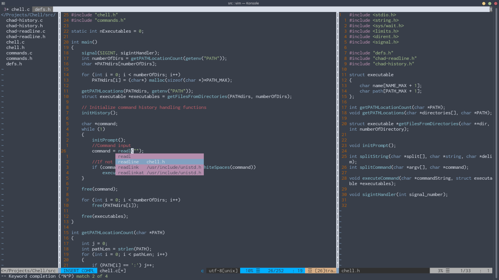

# dotfiles
Some of my dotfiles or configuration files for some of the stuff I use.

## .bashrc

Nothing too interesting, just gives a cool figlet on opening the terminal and runs the [script for the prompt(ps1.prompt)](./ps1.prompt).

### .bashrc.asliases

This file contains a couple of aliases that I use almost daily. Most of them are self explanatory.

- gdbx and gdbx64 run GDB with the command file [gdbCommands](./gdbCommands) and [gdbCommands64](./gdbCommands64) respectively. Used to make gdb a little but more usable out of the box and display the registers, stack, and instructions everytime you step.

## .vimrc

Contains my vim setup which I use for C development and python/BASH scripting.
